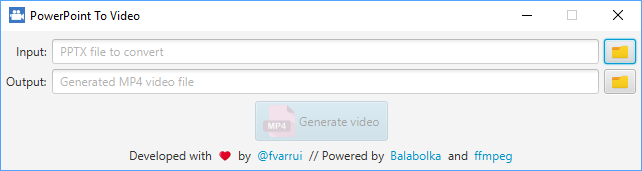
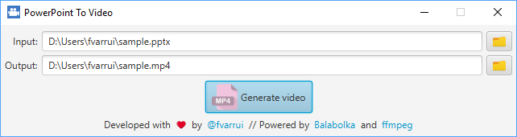

# PowerPointToVideo

PowerPoint slide show to MP4 video converter with synthesized interlocutor voice.

## Users

PowerPointToSlide generate a MP4 video from a PPTX file, speeching the slides notes with a synthetisized voice while they are showed.

1. [Download](https://github.com/fvarrui/PowerPointToVideo/releases/download/v0.0.1/PowerPointToVideo_0.0.1.exe) and install PowerPointToVideo.

2. Open the application:

   

3. Choose an input PPTX file and an output MP4 destination file.

   

   > In this example we are using [sample.pptx](https://github.com/fvarrui/PowerPointToVideo/raw/master/samples/sample.pptx).

   > :warning: Remember that your PPTX file must include notes in each slide, which will be spoken by the speech synthesizer.

4. Push Generate and wait until it finish.

   

To see the result follow this [link](https://www.youtube.com/watch?v=e9v84aHcUbI).

## Developers

1. Download and install [JavaPackager Maven Plugin](https://github.com/fvarrui/JavaPackager/blob/master/README.md).

2. Download project source code and enter in the project folder:

   ```bash
   git clone https://github.com/fvarrui/PowerPointToVideo.git
   cd PowerPointToVideo
   ```

3. Compile and package the project:

   ```bash
   mvn package
   ```

   This generate an EXE installer for Windows in `target` folder.

   > All dependencies are automatically download while packaging.

### Dependencies

* [Balabolka Command Line Utility](http://www.cross-plus-a.com/balabolka.htm): command line version of a text-to-speech tool
* [ffmpeg](https://ffmpeg.org/): A complete, cross-platform solution to record, convert and stream audio and video.